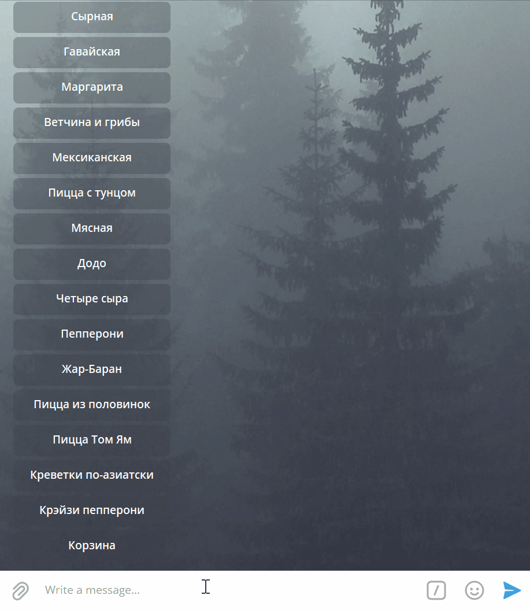

# PIZZA SHOP BOT



App represents telegram bot for customers of imagined "Pizza Shop". "Pizza shop" is a test online shop with data hosted on [Elasticpath](https://www.elasticpath.com/) e-commerce platform.

Bot allows to user to:
- list all available items
- go into product details
- add them to the cart
- delete items from the cart
- find the nearest pizzeria according to provided address or coordinates
- calculate delivery cost based on the distance to the nearest pizzeria
- process to checkout with the test payment method

Link to telegram bot: [Bot](https://t.me/devman_pizzza_bot)

## Install

At least Python 3.8 and Git should be already installed.

1. Clone the repository
```
git clone https://github.com/balancy/pizza-bot
```

2. Go inside cloned repository, create and activate virtal environment:
```console
python -m venv .venv
source .venv/bin/activate (.venv\scripts\activate for Windows)
```

3. Install dependecies:
```console
pip install -r requirements.txt
```

4. Rename `.env.example` to `.env` and define your environment variables

- `CLIENT_ID` - client id of your [elasticpath](https://www.elasticpath.com/) account
- `CLIENT_SECRET` - client secret of your [elasticpath](https://www.elasticpath.com/) account
- `TG_BOT_TOKEN` - token of your telegram pizza shop bot. Could be acquired via [BotFather](https://t.me/BotFather).
- `YANDEX_API_TOKEN` - token of your yandex account. Could by acquired via [yandex](https://developer.tech.yandex.ru/services/).
- `PAYMENT_PROVIDER_TOKEN` - token of payment provider for your telegram bot. Could be acquired via [BotFather](https://t.me/BotFather).

## Launch telegram bot via console

```console
python bot.py
```

## Launch telegram bot via docker

#### Create docker image

```console
docker build -t pizza-bot .
```

#### Launch docker container

1. You can use the following command if you want to use the same setup of environment variables we used locally:

```console
docker run --env-file ./.env pizza-bot
```

2. If you want to use different setup of environment variables:

Make a copy of .env file:

```console
cp .env .env.prod
```

Define your proper production environment variables in `.env.prod`

- `CLIENT_ID` - client id of your [elasticpath](https://www.elasticpath.com/) account
- `CLIENT_SECRET` - client secret of your [elasticpath](https://www.elasticpath.com/) account
- `TG_BOT_TOKEN` - token of your telegram pizza shop bot. Could be acquired via [BotFather](https://t.me/BotFather).
- `YANDEX_API_TOKEN` - token of your yandex account. Could by acquired via [yandex](https://developer.tech.yandex.ru/services/).
- `PAYMENT_PROVIDER_TOKEN` - token of payment provider for your telegram bot. Could be acquired via [BotFather](https://t.me/BotFather).

Run container:

```console
docker run --env-file ./.env.dev pizza-bot
```

#### Test payment card for telegram bot

- `4242 4242 4242 4242`

## Launch fb bot via console locally

1. Configure [webhook for fb](https://gist.github.com/voron434/3765d14574067d17aa9e676145df360e)

2. Create [redis db](https://redis.com/)

3. Rename `.env.example` to `.env` and define your environment variables

- `CLIENT_ID` - client id of your [elasticpath](https://www.elasticpath.com/) account
- `CLIENT_SECRET` - client secret of your [elasticpath](https://www.elasticpath.com/) account
- `PAGE_ACCESS_TOKEN` - fb web hook page access token
- `VERIFY_TOKEN` - fb web hook verify token
- `REDIS_HOST` - redis db
- `REDIS_PORT` - redis port
- `REDIS_PASSWORD` - redis password

4. Launch app
```
gunicorn fb_bot:app
```
